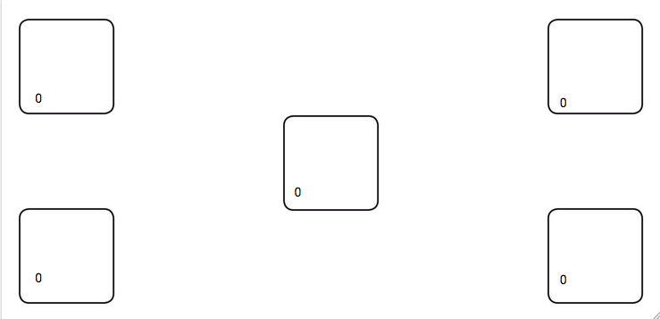

AttentionWickens
================
Application nécessaire pour la passation d'une expérimentation à la fac.  
Elle permet simplement de compter le nombre de taps dans les 5 carrés.  
Elle utilise Ionic&Angular afin de créer une application mobile à partir de code HTML, CSS et Typescript.  

Installation
============
- Cloner le projet
- Lancer "npm install" afin d'installer les modules Node et les plugins nécessaires (installer Node.js si nécessaire)
- Lancer "npm install -g @ionic/cli" afin d'installer les commandes Ionic
- Lancer "npm install @ionic/angular@latest --save" afin d'installer Angular  

Si vous voulez déployer sur un appareil android :
-------------------------------------------------
- Lancer "ionic cordova prepare android" afin de preparer la platform Android (nécessite Android Studio et le SDK)
- Lancer "ionic cordova run android -l" sur un appareil connecté (nécessite ADB) ou alors sur un émulateur  

Si vous voulez déployer dans le navigateur : 
--------------------------------------------
- Lancer "ionic serve"
 
Voir https://ionicframework.com/docs/installation/cli pour plus d'informations
