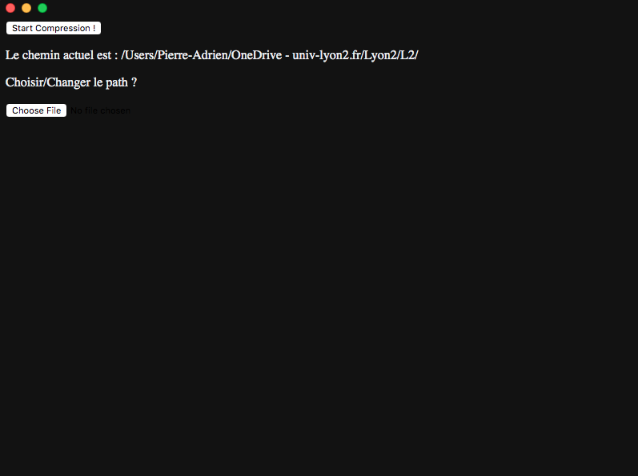

Electron - GUI pour le projet AutoCompressPDF (voir : https://github.com/Pierrad/Programmation/tree/master/Python/AutoCompressPDF)
==================================================================================================================================

Interface graphique pour le programme AutoCompressPDF avec Electron (https://www.electronjs.org/)  
Une interface graphique avec de l'HTML, du CSS et du Javascript lié à du python pour la compression des fichiers.  
L'interface est toujours en cours de développement, voici un aperçu fonctionnel :  

Installation
============
- Cloner le dossier (être sûr d'avoir "release-builds/AutoCompressPDF" qui contient le code python)
- Visiter le lien suivant : "https://github.com/Pierrad/Programmation/tree/master/Python/AutoCompressPDF" pour installer correctement les dépendances nécessaires au programme Python
- Lancer "nmp install" dans le dossier cloner pour installer les modules Node
- Lancer "npm install --save-dev electron" dans le dossier cloner pour installer Electron
- Lancer "npm start" afin d'essayer l'application
- Lancer
  - "npm run package-mac" pour créer un exécutable sur MacOS
  - "npm run package-win" pour créer un exécutable sur Windows
  - "npm run package-linux" pour créer un exécutable sur une distribution Linux
